# node 跑通 微信公众号 开发者功能

> 关键字： node express 服务器 域名 centos  微信公众号 自定义 开发


文末 **扩展** 有惊喜！！！ 好玩的功能

文末 **扩展** 有惊喜！！！好玩的功能

文末 **扩展** 有惊喜！！！好玩的功能


一文 扫除 搭建微信公众号环境的 易错点。从外太空 到内xx 的扫盲教程。

请注意 关键是 流程的跑通，不是 最终功能的实现。

# 最终演示结果 1

随便输入文字，公众号 返回当前的时间


# 最终演示结果2

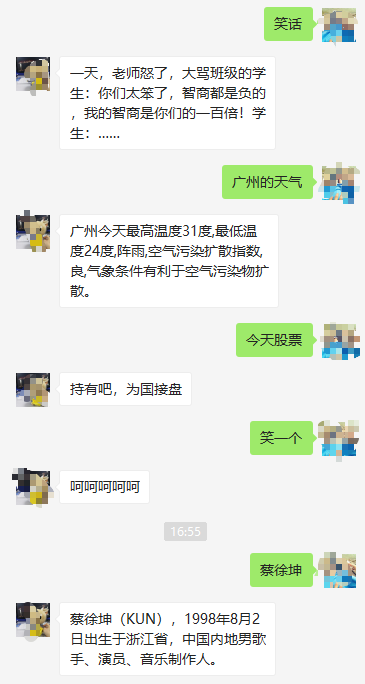

# 试玩演示


# 流程说明

要跑通整个流程，需要经历以下几步

1. 开通云服务器
2. 注册域名
3. 申请备案
4. 编写 node 后台代码 验证token非法性
5. 服务器上部署代码
6. 公众号开启 服务器配置
7. 测试 公众号功能

# 云服务器域名开通过程

## 开通 [腾讯云服务器](https://cloud.tencent.com/?fromSource=gwzcw.2212127.2212127.2212127&utm_medium=cpd&utm_id=gwzcw.2212127.2212127.2212127)

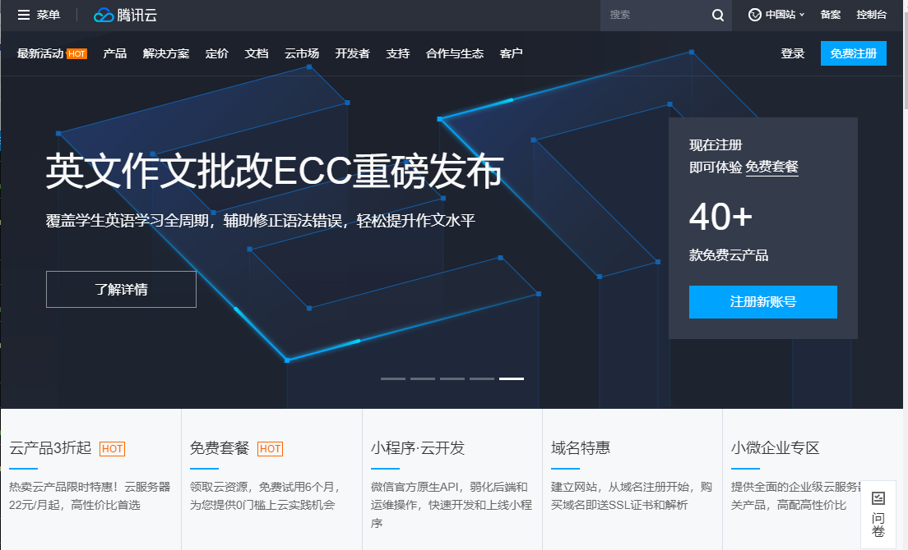

------

因为公众号最终是要面向外网使用的，那么就必须要有一台对外的服务器，推荐使用云服务器（自己做过内网穿透映射也可以，但是不方便）。

云服务器 推荐 腾讯云 和 阿里云。因为 微信公众号是腾讯云的，所以强烈推荐[腾讯云](https://cloud.tencent.com/?fromSource=gwzcw.2212127.2212127.2212127&utm_medium=cpd&utm_id=gwzcw.2212127.2212127.2212127)。

> 新用户或者大学生都有优惠，最便宜的配置 大概20元一个月，不同时期不同活动。

### [注册账号](https://cloud.tencent.com/register?s_url=https%3A%2F%2Fcloud.tencent.com%2F%3FfromSource%3Dgwzcw.2212127.2212127.2212127%26utm_medium%3Dcpd%26utm_id%3Dgwzcw.2212127.2212127.2212127)

以下随便哪种都行。

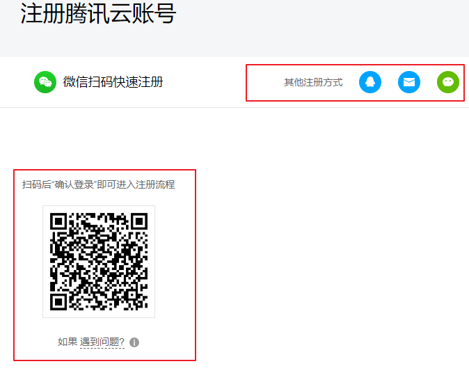

### 购买服务器

注册成功后，进行登录，然后[选购服务器](https://buy.cloud.tencent.com/cvm?tab=lite&bandwidth=1&loginSet=SET_PASSWORD)。`地域` 推荐选择 **广州** 备案起来更方便。

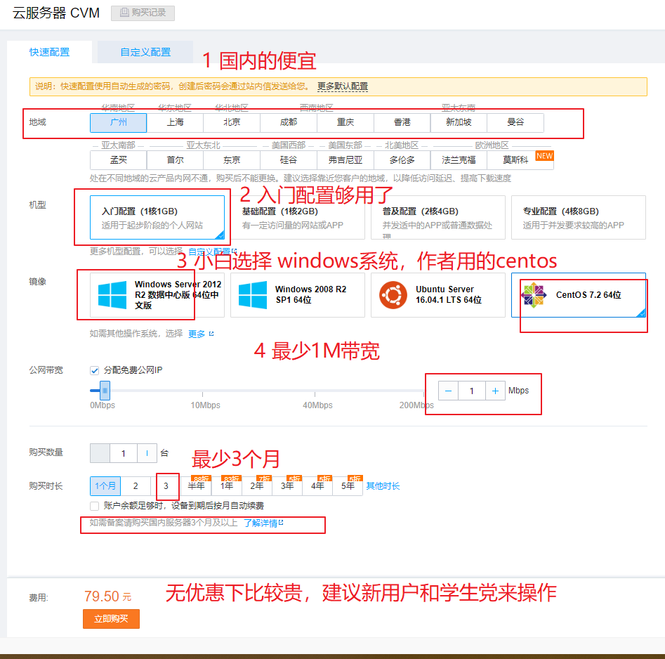

购买成功后，可以看到如下界面

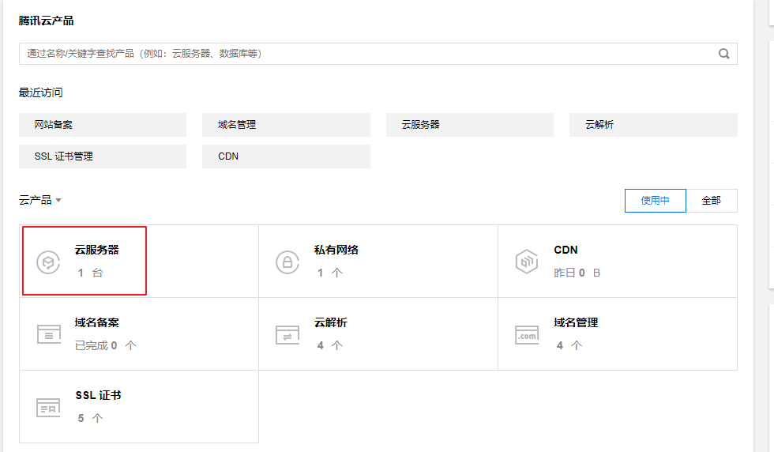

## [选购域名](https://buy.cloud.tencent.com/domain?from=console)

因为服务器对外使用，要么直接用ip，要么绑定一个域名，而微信公众号必须要绑定域名，因此，提前注册一个域名吧。

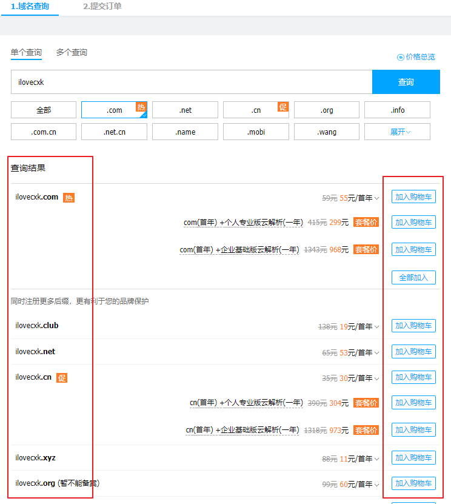

需要注意的是 `xyz  club`等域名 首年便宜，后几年贵，如果长期使用，还是建议 `com cn`这类域名。

## [域名解析](https://console.cloud.tencent.com/domain)

域名选购成功后，还不能马上使用，要进行解析。进入到域名管理页面。 选择你购买好的域名，点击 **解析**

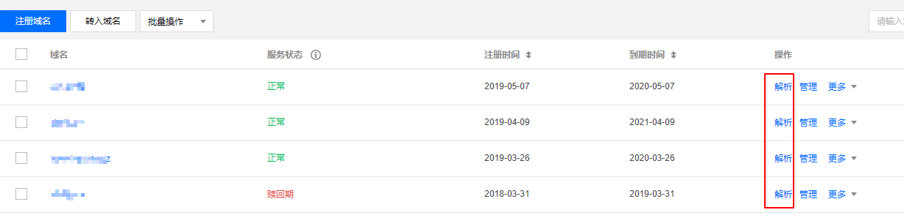

添加解析记录

1. `www` 可以解析 如 `www.baidu.com` 这样
2. `@` 可以解析 `baidu.com`
3. `*` 泛域名，可以解析很多 如 `wx.baidu.com` `api.baidu.com`...方便后期自己扩展
4. 其他。。

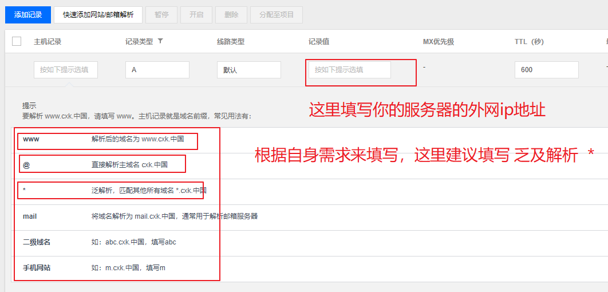

填写完毕之后，需要等待十分钟，才可以生效。

在生效的几天之内，是可以直接用域名来访问到你的服务器的，如果要长期顺利使用，就必须要**备案域名**

## [备案域名](https://console.cloud.tencent.com/beian)

在国内要用域名访问服务器，就必须要备案。

备案的途径目前两种

1. 电脑上备案，比较繁琐，还有腾讯那边给你寄一张幕布，然后拍照，再上传，一来一会就好几天了。**不推荐**

   

2. 在小程序上备案，手机上直接点点点就可以了，相对简单，**推荐**

   

需要注意的是 不管是在电脑上还是在小程序上备案，都需要准备如下资料。

1. 个人身份证的正反照，清晰一点的

2. 要打印纸质的材料，然后手动签名（流程中有提示的）

3. 填写网站资料的时候，如果是个人用户，建议如下

   1. 要留两个自己的手机号码，必须的。
   2. 个人通信地址要详细到街道，门牌号（目前自己的居住地址）
   3. 网站的名称，不要写个人博客和其他带有商业性质的，直接写 个人开发学习使用即可

4. 其实，资料填错也没有所谓，因为腾讯云北京总部，会反复打电话给你来核实资料和纠正资料的，很贴心，电话结束后都不要记得给小姐姐好评哈，按 `1`给好评 😄！！。

   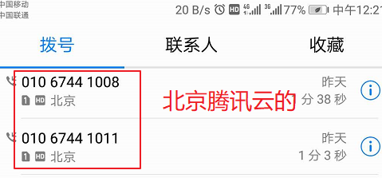

5. 备案过程，最终是工信部那边审核的，时间有长有短 。30天左右。看你有没有幸被翻牌，早点翻就早点过去。

   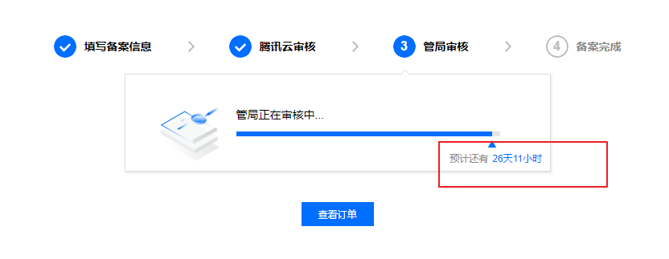

# 服务器部署搭建环境

等待域名备案的同时，我们可以来搭建服务器。

作者搭建服务器的环境如下

- centos 7 
- nginx 
- node express

## 连接服务器

通过ssh的方式来连接服务器，进行环境安装，工具有很多种，`xshell` `putty` 等。作者这里用的是 `xshell`

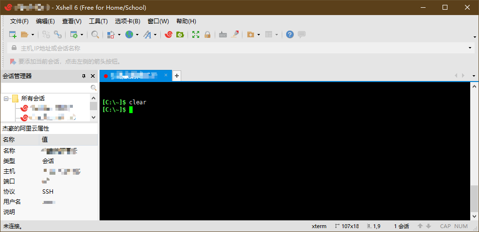

**新建连接**

`文件 > 新建`

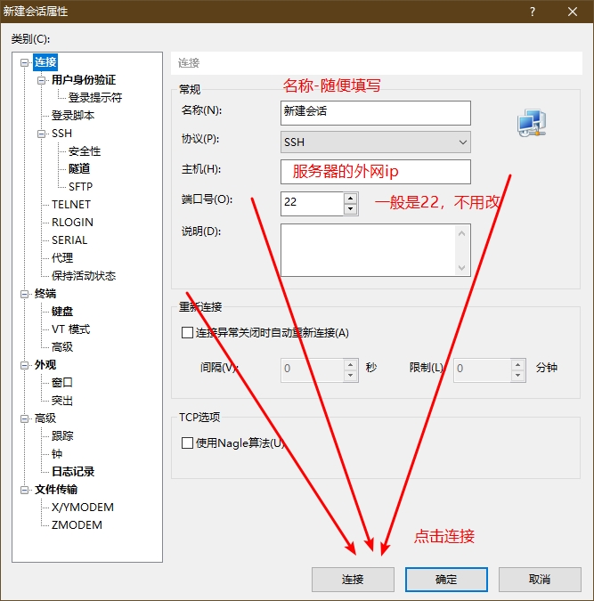

---

然后会弹出提示，让你输入用户名和密码

1. **用户**名 默认是 root

2. **密码** 是你在选购服务器，选择系统的时候就会进行设置的，假如已经忘记了，[可以在腾讯云的后台管理上进行重置](https://console.cloud.tencent.com/cvm/index)

   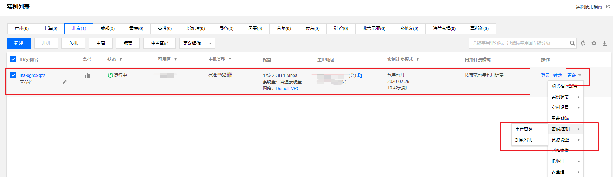

-----

成功登录后，恭喜你，可以看到如下界面

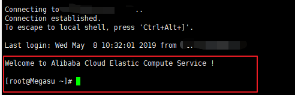

## 安装nginx

> [什么是nginx](https://baike.baidu.com/item/nginx/3817705?fr=aladdin)
>
> Nginx (engine x) 是一个高性能的 HTTP 和反向代理服务器

由于后期我们是通过`nginx`来管理服务器的请求和代理node服务器。因此，我们需要先搭建`nginx`。

### 检查系统版本

检查看看是否是 centos 7  命令行中输入

```sh
cat /etc/redhat-release 
```

**提示**：

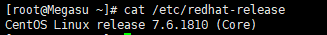

### 添加 yum 源

> yum可以理解为 centos中的360软件管家，是来下载软件和工具的

Nginx 不在默认的 yum 源中，可以使用 epel 或者官网的 yum 源，本例使用官网的 yum 源

```sh
sudo rpm -ivh http://nginx.org/packages/centos/7/noarch/RPMS/nginx-release-centos-7-0.el7.ngx.noarch.rpm
```

### 安装nginx

```sh
sudo yum install nginx
```

### 修改配置文件

如要想实现 访问你的域名 例如： `wx.baidu.com` 便跳转到 你服务器上的某个服务器端口。

`wx.baidu.com`  ->>>   `127.0.0.1:9090`

由于初学者可能不懂的如何在命令中来编辑文件（其实可以通过vi编辑器来操作），那么为了方便操作，建议使用图形化的工具[wincp](https://baike.baidu.com/item/winscp/2754769),就可以类似操作 本地的资源管理器一样。

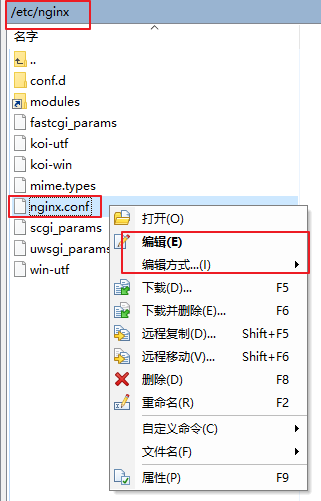

下载 安装好 `wincp`后，新增远程连接

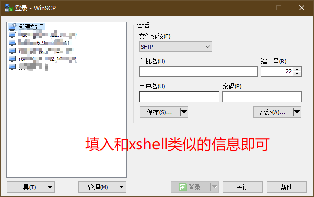

---

成功登录，便能看到类似的界面

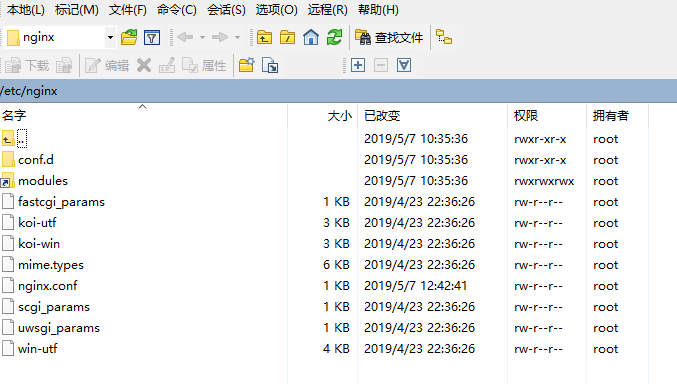


---


找到配置文件  `/etc/nginx/nginx.conf` 添加以下配置

```nginx
    # 定义映射到本地的端口  9091
	upstream wx{
        server 127.0.0.1:9091;
    }

 # 新增的服务配置 
    server {
    # 监听80端口号 
    listen       80;
    # 监听的域名 
    server_name  wx.baidu.com;
    
   
    location / {
        proxy_set_header Host $host;
        proxy_set_header X-Forwarded-For $proxy_add_x_forwarded_for;
        # 代理到 本地的 90901端口 
        proxy_pass http://wx;
    }
}
```

如不会配置，则全部复制以下代码，完全替换即可

```nginx

user  nginx;
worker_processes  1;

error_log  /var/log/nginx/error.log warn;
pid        /var/run/nginx.pid;


events {
    worker_connections  1024;
}


http {
    include       /etc/nginx/mime.types;
    default_type  application/octet-stream;

    log_format  main  '$remote_addr - $remote_user [$time_local] "$request" '
                      '$status $body_bytes_sent "$http_referer" '
                      '"$http_user_agent" "$http_x_forwarded_for"';

    access_log  /var/log/nginx/access.log  main;

    sendfile        on;
    #tcp_nopush     on;

    keepalive_timeout  65;

    #gzip  on;
    include /etc/nginx/conf.d/*.conf;

    # 定义映射到本地的端口  9091
	upstream wx{
        server 127.0.0.1:9091;
    }

 	#新增的服务配置 
    server {
    # 监听80端口号 
    listen       80;
    # 监听的域名 
    server_name  wx.baidu.com;       
    location / {
        proxy_set_header Host $host;
        proxy_set_header X-Forwarded-For $proxy_add_x_forwarded_for;
        # 代理到 本地的 90901端口 
        proxy_pass http://wx;
    }
}

}

```


编辑好后，启动`nginx`

```sh
sudo systemctl start nginx
```

浏览器中输入 `wx.baidu.com`


可以看到nginx服务器的提示，502是因为 你的 9091没有放如何服务。下一步，开始部署服务。

### 其他常见命令

设置开机启动

```sh
sudo systemctl enable nginx
```

启动服务

```sh
sudo systemctl start nginx
```

重启服务

```sh
sudo systemctl restart nginx
```

暂停服务

```sh
sudo systemctl stop nginx
```

测试配置是否正确(用来检查配置是否ok，能否失效的)

```sh
sudo nginx -t
```

重启nginx服务

```sh
sudo nginx -s reload
```

## 部署node后台服务

其实微信公众号对于后台语言并没有什么要求，你只要安装接口约定，做好权限验证，发送的格式不要出错即可。那么我们在这里使用node+express来搭建一个简单的后台服务。

### 克隆项目

```sh
git clone https://github.com/itcastWsy/wx_public.git
```

### 进入项目

```
cd wx_public
```

安装依赖

```
npm install
```

### 修改token

打开 `routes\wxapi.js`下的 第六行 填入你的`token`即可。

`token`  **必须为英文或数字，长度为3-32字符。**  要自己记住哦！

```
var token = "";
```

### 启动项目

```
npm run start
```

## 配置微信公众号后台

还剩下最后一步，现在打开微信公众平台，进行[登录](https://mp.weixin.qq.com/)。

[常见帮助文档](https://mp.weixin.qq.com/wiki?t=resource/res_main&id=mp1421140183)

### 基本设置

登录成功后，在左侧菜单栏，点击 **基本配置**

需要说明的是 服务器地址，需要填写你之前备案过的域名 如 `http://wx.baidu.com`

因为我们在express后台中，是加一一层路由嵌套，此时地址就变成。 `http://wx.baidu.com/wx`

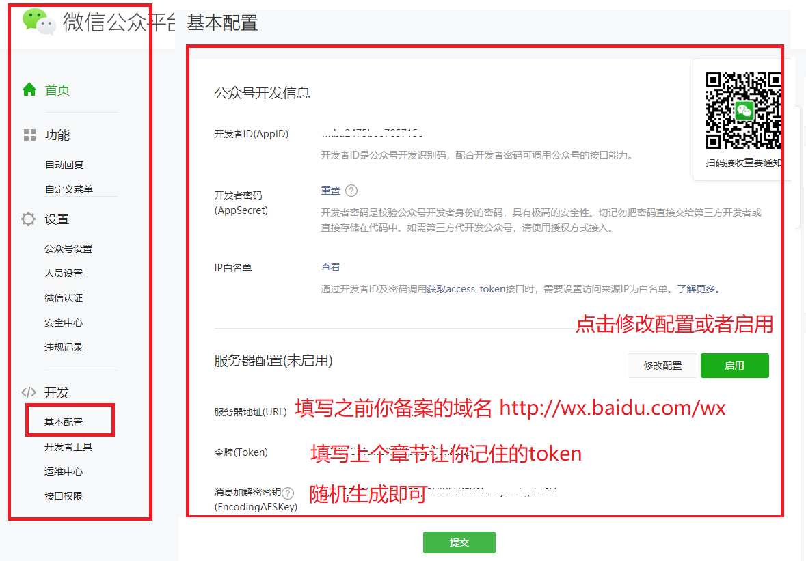


---

当验证通过时，会弹出如下提示

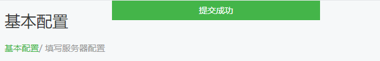


# 测试是否成功

此时，打开我们的微信公众号，随便输入消息


至此，大功告成。

# 拓展

这么情况搭建好的环境，不骚跳一下 对得起自己吗

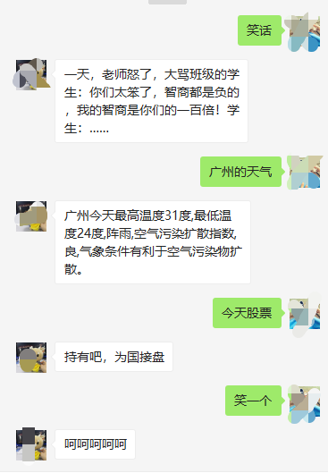

我们现在通过简单的几个操作，便可以为公众号接入 人工智能 对话！！ 而且还是免费的！！！

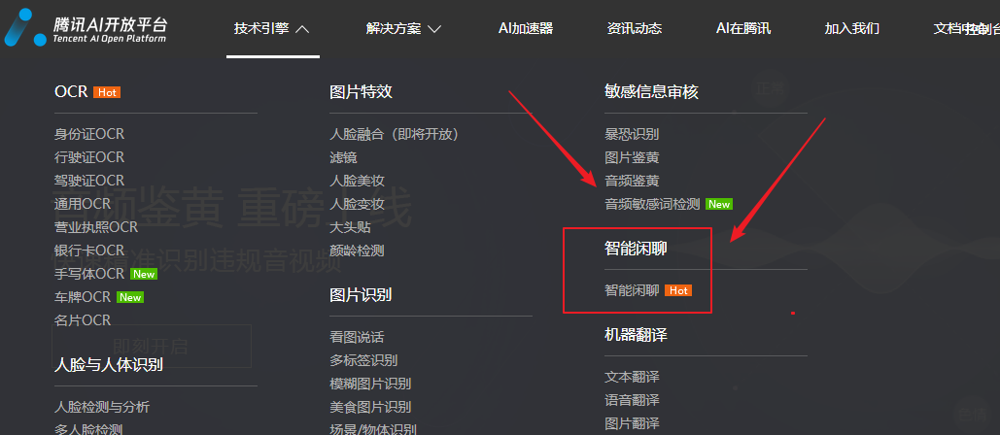

## [注册腾讯AI](https://ai.qq.com)

点击右上角的 **控制台** 安装提示 即可完成 注册


## [创建应用](https://ai.qq.com/console/application/create-app)

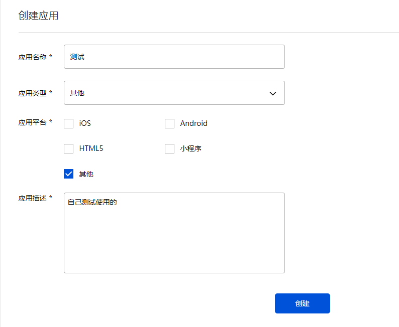

## [接人 智能闲聊 功能](https://ai.qq.com/console/capability/overview)

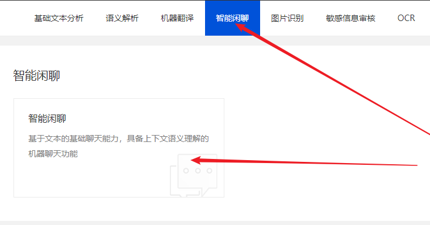

---

完成接入

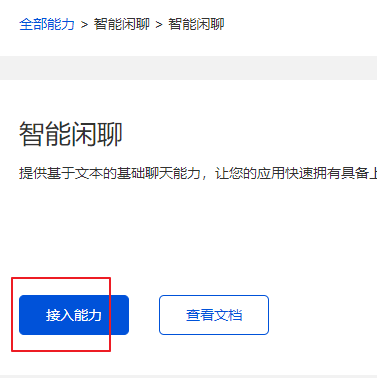


## [一键接入微信公众号](https://ai.qq.com/doc/nlpchat.shtml#一键接入微信公众号)

使用内置功能，一键即可完成接入。

[公众号授权](https://ai.qq.com/console/application/2116379708/advconfig-intelchat)

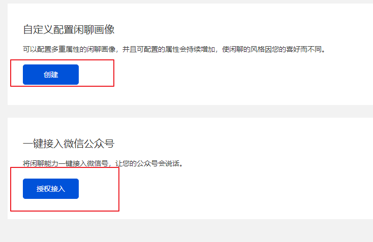

点击授权接入后，接下来扫描二维码即可

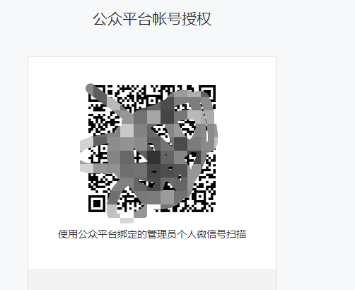


## 测试对话

此时，再回到你的公众号，随便闲聊。 建议此时 关闭  微信公众后台的服务器配置功能

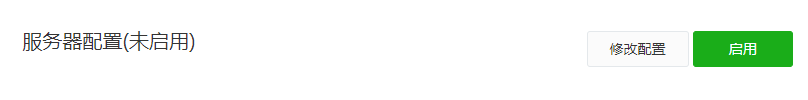


# 帮助文档

1. [腾讯云](https://cloud.tencent.com/document/product)
2. [centos](https://cloud.tencent.com/search/centos/7_1)
3. [nginx](https://cloud.tencent.com/document/product/214/33413)
4. [node](http://nodejs.cn/api/)
5. [express](http://www.expressjs.com.cn)
6. [腾讯AI](https://ai.qq.com/doc/home.shtml)